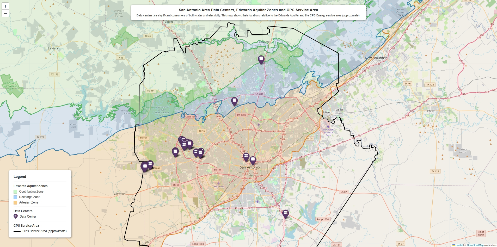

# San Antonio Data Centers: Power & Water
Interactive map exploring data center locations, electric utility service territory, and Edwards Aquifer zones in San Antonio, TX area.
Built with Python, GeoPandas, and Folium.

## Overview
As data center development accelerates to support AI and other applications, San Antonio has emerged as a growing hub for digital infrastructure.  This project visualizes where data centers are locating relative to the electric utility service boundaries and the Edwards Aquifer - a critical and sensitive water supply for the region.  The result is an interactive map that layers infrastructure, energy and water in a single view.  

## Map Layers
- **Data Centers** — locations sourced from OpenStreetMap via the Overpass API
- **CPS Energy Service Territory** — Boundary derived from CPS Energy's published service territory map (see methods below)
- **Edwards Aquifer Zones** — boundary data provided by the Edwards Aquifer Authority

## Screenshot


## Output


## Data Sources & Methodology

### OpenStreetMap
Data center locations were queried at runtime using the 
[Overpass API](https://overpass-api.de/). Map data © 
[OpenStreetMap contributors](https://www.openstreetmap.org/copyright), 
available under the Open Database License (ODbL).

### CPS Energy Service Boundary
The CPS Energy service territory boundary was extracted from a PDF map 
titled *CPS Energy Service Territory* (`service_area_map_2011.pdf`), 
downloaded from [cpsenergy.com](https://www.cpsenergy.com) in February 
2026. The extraction process involved the following steps:

1. Used **PyMuPDF** to render the first page of the PDF as a raster image
2. Cropped the image to the map area
3. Applied **OpenCV** color thresholding to isolate the light blue region 
   representing the service territory
4. Extracted contours and selected the largest contour as the boundary
5. Converted pixel coordinates to lat/lon using hardcoded geographic bounds
6. Simplified the resulting polygon with **Shapely**
7. Exported as GeoJSON (`cps_service_boundary.geojson`)

The output GeoJSON is included in this repository so the full map can be 
reproduced without re-running the extraction pipeline.

### Edwards Aquifer Zones
Aquifer zone boundary data was provided by the 
[Edwards Aquifer Authority](https://www.edwardsaquifer.org/). Please 
refer to their website for terms of use before redistributing this data.


---

## Requirements
```
python >= 3.9
geopandas
folium
pandas
requests
shapely
opencv-python
pymupdf
...
```

## Setup & Usage
1. Download repository
2. Adjust directory folder name, as preferred
3. Set up environment and download required libraries
4. Consider whether file / data updates are needed from Edwards Aquifer Authority, CPS energy or other as detailed and due to the passage of time
5. Run 'san_antonio-data_centers.py' to produce an html file with the data center locations
6. Run 'build_map_aquifer_overlay.py' to update the html file with the Edwards Aquifer zones and the CPS service area boundary as overlays on the map

## Notes on AI Collaboration
AI tools were used to collaborate on and guide portions of this project,
particularly the PDF extraction pipeline and geospatial processing
workflow. All code has been reviewed and tested by the author.

## License
This project is licensed under the MIT License. See LICENSE
for details.

Data licenses vary by source — see the Data Sources section above for
attribution and terms applicable to each dataset.

## Author
Jackie L Day
www.linkedin.com/in/jacquelineday
